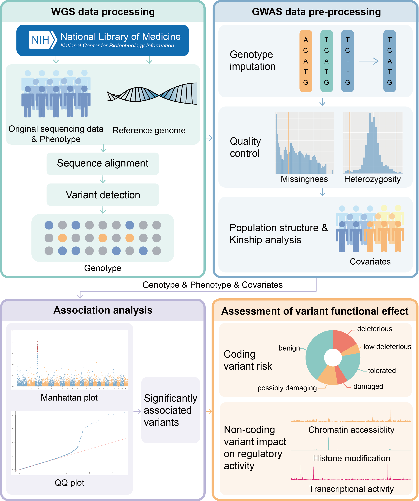

# GwasWA Manual

GwasWA: A GWAS One-stop Analysis Platform from WGS Data to Variant Effect Assessment



## Contents


- [GwasWA Installation Guide](#gwaswa-installation-guide)
- [General Parameters](#general-parameters)
- [WGS Data Processing](#wgs-data-processing)
  - [Download sequence data, `-- step downloadsra`](#download-sequence-data----step-downloadsra)
  - [Convert SRA to FASTQ, `--step sratofastq`](#convert-sra-to-fastq---step-sratofastq)
  - [FASTQ quality control, `--step readsqc`](#fastq-quality-control---step-readsqc)
  - [Quality evaluation, `--step qualityevaluation`](#quality-evaluation---step-qualityevaluation)
  - [Download \& index reference genome, `--step downloadref`](#download--index-reference-genome---step-downloadref)
  - [Alignment reference genome, `--step align`](#alignment-reference-genome---step-align)
  - [BAM files processing, `--step dealbam`](#bam-files-processing---step-dealbam)
  - [Variant detection, `--step detect`](#variant-detection---step-detect)
  - [Jointgenotype, `--step jointgenotype`](#jointgenotype---step-jointgenotype)
  - [VCF quality control, `--step vcfqc`](#vcf-quality-control---step-vcfqc)
- [GWAS Data Pre-processing](#gwas-data-pre-processing)
  - [Genotype imputation, `--step impute`](#genotype-imputation---step-impute)
  - [Convert VCF to bfiles, `--step transvcf`](#convert-vcf-to-bfiles---step-transvcf)
  - [GWAS quality control, `--step gwasqc`](#gwas-quality-control---step-gwasqc)
  - [Population structure analysis, `--step pca`](#population-structure-analysis---step-pca)
  - [Kinship analysis, `--step kinship`](#kinship-analysis---step-kinship)
- [Association Analysis](#association-analysis)
  - [Association analysis, `--step association`](#association-analysis---step-association)
  - [Select significant variant, `--step selectsnp`](#select-significant-variant---step-selectsnp)
- [Assessment of Variant Functional Effect](#assessment-of-variant-functional-effect)
  - [Variant impact assessment, `--step assess`](#variant-impact-assessment---step-assess)
- [Quick Start](#quick-start)
  - [WGS data Processing](#wgs-data-processing-1)
    - [Download sequencing data, `--step downloadsra`](#download-sequencing-data---step-downloadsra)
    - [Convert SRA to FASTQ, `--step sratofastq`](#convert-sra-to-fastq---step-sratofastq-1)
    - [FASTQ quality control, `--step readsqc`](#fastq-quality-control---step-readsqc-1)
    - [Quality evaluation, `--step qualityevaluation`](#quality-evaluation---step-qualityevaluation-1)
    - [Download \& index reference genome, `--step downloadref`](#download--index-reference-genome---step-downloadref-1)
    - [Alignment of reference genome, `--step align`](#alignment-of-reference-genome---step-align)
    - [BAM files Processing, `--step dealbam`](#bam-files-processing---step-dealbam-1)
    - [Variant detection, `--step detect`](#variant-detection---step-detect-1)
    - [Jointgenotype, `--step jointgenotype`](#jointgenotype---step-jointgenotype-1)
    - [VCF quality control, `--step vcfqc`](#vcf-quality-control---step-vcfqc-1)
  - [GWAS analysis](#gwas-analysis)
    - [Convert VCF to bfiles, `--step transvcf`](#convert-vcf-to-bfiles---step-transvcf-1)
    - [GWAS quality control, `--step gwasqc`](#gwas-quality-control---step-gwasqc-1)
    - [Population structure analysis, `--step pca`](#population-structure-analysis---step-pca-1)
    - [Kinship analysis, `--step kinship`](#kinship-analysis---step-kinship-1)
    - [Association analysis, `--step association`](#association-analysis---step-association-1)
    - [Select significant variants, `--step selectsnp`](#select-significant-variants---step-selectsnp)
  - [Assessment of variant effect](#assessment-of-variant-effect)
    - [Variant effect assessment, `--step assess`](#variant-effect-assessment---step-assess)


# GwasWA Installation Guide

To install GwasWA, follow these steps:

`conda env create -f environment.yml`

`conda activate pipe`

`pip install -r requirements.txt`


To access GwasWA globally, add the GwasWA folder to the environment variable:

`export PATH="/path/to/gwaswa:$PATH"`

Append variable settings to the end of the file `~/.bashrc`. Execute the following command to make the changes take effect:

`source ~/.bashrc`

# General Parameters

-   `--version`: Retrieve the current version of the tool.
-   `-o, --output <path>`: The default value is current directory. Specify the directory for the output file.
-   `--nosave`: Prevent the tool from saving intermediate files.
# WGS Data Processing

## Download sequence data, `-- step downloadsra`

For downloading sequence data, utilize the following commands and their respective parameters:

-   `--sra <str>`: Download SRA files based on specified SRA accessions. Separate multiple accessions by spaces.
-   `--sralist <filename>`: Download SRA files using a list in a `srr_list.txt` file. Each line in the file represents a SRA accession.
-   `--nThrds <int>`: Number of simultaneous downloads to be initiated.

```
gwaswa --step downloadsra --sra SRR1111111 [SRR2222222 ...]
gwaswa --step downloadsra --sralist srr_list.txt
```

The downloaded SRA files associated with the specified SRA accession(s) will be stored in the `gwaswaOutput/wgs/sra` directory. In case of download or integrity verification failures, the file `err_sra_log.txt` will be generated in the `gwaswaOutput/wgs/sra` directory to track failed SRA accessions.

## Convert SRA to FASTQ, `--step sratofastq`

To convert SRA files to FASTQ format, employ the following command with the respective parameters:

-   `--sradir <path>`: Directory containing the SRA files to be converted into FASTQ format.
-   `--nThrds <int>`: Number of simultaneous conversions into FASTQ format, including compression into `.gz` files.

```
gwaswa --step sratofastq --sradir gwaswaOutput/wgs/sra
```

Once the conversion of the input SRA files in the designated directory is completed, the resulting FASTQ files will be stored in the `gwaswaOutput/wgs/raw` directory in compressed format.

## FASTQ quality control, `--step readsqc`

To perform quality control on FASTQ files, utilize the following command with the associated parameters:

-   `--rawfastqdir <path>`: Directory containing FASTQ files for quality control.
-   `--quality <int>`: The default value is 20. Set the Phred quality threshold, low-quality bases at the 3' end are trimmed based on this threshold.
-   `--phred <str>`: Choose the Illumina version for quality scoring. Options:
    -   `phred33`: Default. For Illumina 1.9+ using ASCII 33 quality scores.
    -   `phred64`: For Illumina 1.5 using ASCII 64 quality scores.
-   `--length <int>`: The default value is 20. Sets a length threshold. Reads below this threshold after quality control will be rejected.
-   `--stringency <int>`: The default value is 1. Allows a certain number of bases of the linker sequence to remain at the end.
-   `--error <float>`: The default value is 0.1. Specifies the maximum allowable error rate.
-   `--nThrds <int>`: Number of concurrent quality control processes for FASTQ files, including compression into `.fq.gz` format.

```
gwaswa --step readsqc --rawfastqdir gwaswaOutput/wgs/raw
```

Once the quality control process is completed, the cleaned FASTQ files will be stored in the `gwaswaOutput/wgs/clean` directory.

## Quality evaluation, `--step qualityevaluation`

For quality evaluation of FASTQ files, employ the following command with its respective parameters:

-   `--fastqdir <path>`: Directory containing the FASTQ files needing quality evaluation.
-   `--nThrds <int>`: Number of threads allocated for quality evaluation.

```
gwaswa --step qualityevaluation --fastqdir gwaswaOutput/wgs/clean
```

The quality evaluation report, generated using `fastqc` and `multiqc`, will be stored in the `gwaswaOutput/wgs/qualityEvaluation` directory.

## Download & index reference genome, `--step downloadref`

For downloading and indexing the reference genome, you can use the following commands with their respective parameters:

-   `--accession <str>`: Use this to provide a NCBI Reference sequence accession if you don't have a local reference genome file available. This will download the reference genome sequence.

    ```
    gwaswa --step downloadref --refaccession GCF_000001735.4
    ```
    
-   `--taxon <str>`: If you don't have a local reference genome file, you can provide a NCBI Taxonomy ID or taxonomy name to download the reference genome sequence.

-   ```
    gwaswa --step downloadref --taxon 3702
    ```

-   `--refgenome <filename>`: Use this parameter if you already have a local reference genome file available.

    ```
    gwaswa --step downloadref --refgenome example/ref.fa.gz
    ```

The reference genome sequence is downloaded and stored in the `gwaswaOutput/wgs/ref` directory, and the reference genome index file is stored in the same directory as the reference genome.

## Alignment reference genome, `--step align`

To align the reference genome, you can use the following command with its associated parameters:

-   `--cleanfastqdir <path>`: Directory for storing each FASTQ file post quality control.
-   `--alignalgorithm <str>`: Choice of alignment algorithm.
    -   `mem`: Default. Recommended for read lengths in the range of 70bp-1Mbp.
    -   `bwasw`: More sensitive for reads with frequent gaps, suitable for reads typically 70bp-1Mbp in length.
    -   `backtrack`: Recommended for reads less than 100bp.
-   `--refgenome <filename>`: Local reference genome file to be used for alignment.
-   `--nThrds <int>`: Number of FASTQ files to be aligned simultaneously.

```
gwaswa --step align --cleanfastqdir gwaswaOutput/wgs/clean --refgenome gwaswaOutput/wgs/ref/ref.fa
```

Upon aligning the reference genome with the FASTQ file in the input directory, the resulting BAM files will be generated in the `gwaswaOutput/wgs/align` directory.

## BAM files processing, `--step dealbam`

To BAM files processing, use the following command with its associated parameters:

-   `--bamdir <path>`: Directory containing each post-alignment BAM file.
-   `--refgenome <filename>`: Local reference genome file.
-   `--delPCR`: Removal of PCR duplicates.
-   `--nThrds <int>`: Number of BAM files to be processed simultaneously.

```
gwaswa --step dealbam --bamdir gwaswaOutput/wgs/align --refgenome gwaswaOutput/wgs/ref/ref.fa
```

Upon processing the BAM files in the input directory, tasks such as sorting, PCR duplicate removal, and index building will be performed. The resulting `sample_marked.bam` and `sample_marked.bam.bai` files will be generated in the `gwaswaOutput/wgs/processed` directory.

## Variant detection, `--step detect`

For variant detection, use the following command along with its associated parameters:

-   `--processedbamdir <path>`: Directory containing each processed BAM file.
-   `--refgenome <filename>`: Local reference genome file.
-   `--nThrds <int>`: Number of simultaneous BAM files for variant detection.

```
gwaswa --step detect --processedbamdir gwaswaOutput/wgs/processed --refgenome gwaswaOutput/wgs/ref/ref.fa
```

Upon detecting the variants in the BAM files within the input directory, the resulting `sample_g.vcf` file and its index will be generated in the `gwaswaOutput/wgs/gvcf` directory.

## Jointgenotype, `--step jointgenotype`

For jointgenotype, use the following command along with its associated parameters:

-   `--gvcfdir <path>`: Directory containing each gVCF file.
-   `--refgenome <filename>`: Local reference genome file.
-   `--nThrds <int>`: Number of gVCF files split by chromosome simultaneously.

```
gwaswa --step jointgenotype --gvcfdir gwaswaOutput/wgs/gvcf --refgenome gwaswaOutput/wgs/ref/ref.fa
```

The joint genotyping process involves several steps:

1.  Dividing gVCF Files by Chromosome: Initially, each sample's gVCF file in the input directory is split by chromosome and stored in the `gwaswaOutput/wgs/gvcf_chr` directory.
2.  Merging Samples by Chromosome: Next, all samples are merged by chromosome, generating `chrX_g.vcf` and its index file in the `gwaswaOutput/wgs/vcf` directory.
3.  Re-alignment of reference genome file: Each `chrX_g.vcf` file is re-aligned to obtain the `chrX_vcf` file.
4.  Final Merging for Genotyping: The `chrX_vcf` files are then merged to generate `genotype.vcf` and its index files, stored in the `gwaswaOutput/wgs/vcf` directory.

## VCF quality control, `--step vcfqc`

For conducting VCF quality control, use the following command along with its associated parameters:

-   `--vcffile <filename>`: Specifies the VCF file containing variant genotype information.
-   Hard filtering for SNPs:
    -   `--snpQUAL <float>`: The default value is 30.0. This parameter represents the variant quality value, which measures the reliability of the variant based on the QUAL field in the VCF.
    -   `--snpQD <float>`: The default value is 2.0. QD (SNPQualByDepth) is the ratio of the variant quality value divided by the depth of coverage.
    -   `--snpMQ <float>`: The default value is 40.0. MQ (RMSMappingQuality) describes the degree of dispersion of the quality value of the alignment, rather than just the average value.
    -   `--snpFS <float>`: The default value is 60.0. FS (FisherStrand) is derived from the p-value of Fisher's test and describes strand specificity for reads containing variants and reads containing reference sequence bases during sequencing or alignment.
    -   `--snpSOR <float>`: The default value is 3.0. SOR (StrandOddsRatio) is calculated using the symmetric odds ratio test, corrected for strand specificity.
    -   `--snpMQRankSum <float>`: The default value is -12.5. The MappingQualityRankSumTest is used to assess whether the mapping qualities of the reads supporting the reference allele and the alternate allele are significantly different for SNP positions.
    -   `--snpReadPosRankSum <float>`: The default value is -8.0. The Read Position Rank Sum Test for SNPs evaluates the differences in the position of the reads supporting the reference versus the alternate allele.
-   Hard filtering for indels:
    -   `--indelQUAL <float>`: The default value is 30.0.
    -   `--indelQD <float>`: The default value is 2.0.
    -   `--indelFS <float>`: The default value is 60.0.
    -   `--indelSOR <float>`: The default value is 3.0.
    -   `--indelMQRankSum <float>`: The default value is -12.5.
    -   `--indelReadPosRankSum <float>`: The default value is -8.0.

```
gwaswa --step vcfqc --vcffile gwaswaOutput/wgs/vcf/genotype.vcf --refgenome gwaswaOutput/wgs/ref/ref.fa
```

The `genotype.vcf` file undergoes quality control, generating `genotype_filter.vcf` and its index file, which are stored in the `gwaswaOutput/wgs/vcf` directory.

# GWAS Data Pre-processing

## Genotype imputation, `--step impute`

To perform genotype imputation, utilize the following command with its associated parameters:

-   `--genotypefile <filename>`: The VCF file containing variant genotype information.
-   `--nMem <str>`: Maximum memory footprint.
-   `--nThrds <int>`: Number of multiple threads used for genotype imputation.

```
gwaswa --step impute --genotypefile gwaswaOutput/wgs/vcf/genotype_filter.vcf.gz
```

Upon executing this command, the input VCF file will be imputed with genotypes, and the resulting `genotype.vcf.gz` file will be generated in the `gwaswaOutput/gwas/transvcf` directory.

## Convert VCF to bfiles, `--step transvcf`

For converting VCF to bfiles, utilize the following command with its associated parameters:

-   `--genotypefile <filename>`: VCF file containing variant genotype information.
-   `--phenotypefile <filename>`: The phenotype file comprises three columns: sample ID, family ID, and phenotype value (separated by spaces).

```
gwaswa --step transvcf --genotypefile gwaswaOutput/gwas/transvcf/genotype.vcf.gz --phenotypefile pheno.txt
```

This command executes the conversion process, generating bfiles stored in the `gwaswaOutput/gwas/transvcf` directory. The bfiles include BIM, FAM, and BED files, while the phenotype file is added to the FAM file.

## GWAS quality control, `--step gwasqc`

For GWAS quality control, use the following command with its associated parameters:

-   `--bfiledir <path>`: Directory containing the bfiles.
-   `--atgc`: Retains only ATGC alleles.
-   `--snpmiss <float>`: The default value is 0.2. Excludes SNPs with high missingness among subjects.
-   `--indmiss <float>`: The default value is 0.2. Excludes individuals with a high rate of genotype deletion.
-   `--maf <float>`: The default value is 0.05. Sets the minimum allele frequency, and filters out SNPs with low MAF.
-   `--hwe <str>`: The default value is 1e-6. Filters out SNPs deviating from Hardy-Weinberg equilibrium in the control group.
-   `--hweall <str>`: The default value is 1e-6. Filters out all sample deviations from Hardy-Weinberg equilibrium.
-   `--indep <str>`: Utilized for Linkage Disequilibrium (LD) pruning, specifying the window size, step, and variance inflation factor. For instance, `--indep 50 5 2` would mean a window size of 50 SNPs, a step of 5 SNPs, and a variance inflation factor of 2.
-   `--indepPairwise <str>`: Applied for LD-based SNP pruning using pairwise LD calculation. Specifying the window size, step, and paired r2 threshold.
-   `--indepPairphase <str>`: This parameter is also used for LD-based SNP pruning, but it specifically considers phased haplotype data.
-   `--heterozygosity <float>`: The default value is 3. Exclude individuals with high or low heterozygosity.
-   `--checksex`: Check gender differences.
-   `--rmproblemsex`: Deletes individuals with problematic gender assignments.
-   `--imputesex`: Imputes gender based on genotype information.

```
gwaswa --step gwasqc --bfiledir gwaswaOutput/gwas/transvcf
```

Upon executing this command, the bfiles in the input directory will undergo quality control, resulting in the creation of the bfiles after quality control and intermediate quality control files, all stored in the `gwaswaOutput/gwas/qc` directory.

## Population structure analysis, `--step pca`

For conducting population structure analysis, use the following command with its associated parameters:

-   `--cleanbfiledir <path>`: Directory containing the bfiles.
-   `--pcanum <int>`: The default value is 6. The number of principal components for analysis.
-   `--groupnum <int>`: Number of populations for analysis. If not specified, it determines the group number with the lowest CV error among 2-20 groups.

```
gwaswa --step pca --groupnum 3 --cleanbfiledir gwaswaOutput/gwas/gwasqc
```

Upon execution, the input bfiles undergo population structure analysis and PCA, resulting in the generation of `pca.eigenval` and `pca.eigenvec` files containing PCA eigenvalues and eigenvectors. Additionally, it produces diagrams illustrating the principal component analysis (`pca.png`) and population structure (`admixture.png`), all stored in the `gwaswaOutput/gwas/pca` directory.

Principal component analysis chart.


Population structure chart.


## Kinship analysis, `--step kinship`

To conduct kinship analysis, use the following command with its associated parameter:

-   `--cleanbfiledir <path>`: Directory containing the bfiles.

```
gwaswa --step kinship --cleanbfiledir gwaswaOutput/gwas/gwasqc
```

Upon execution, the input bfiles undergo kinship analysis, resulting in the generation of `kinship.txt` and the `kinship.png` diagram. These files are stored in the `gwaswaOutput/gwas/kinship` directory.

Kinship analysis chart.


# Association Analysis

## Association analysis, `--step association`

To conduct association analysis, use the following command with its associated parameters:

-   `--cleanbfiledir <path>`: Directory containing the bfiles.

-   Association analysis model, optional:

    -   `--lm`: Generalized linear model.

        ```
        gwaswa --step association --cleanbfiledir gwaswaOutput/gwas/gwasqc --lm
        ```

    -   `--lmm`: Mixed linear model.
    
        -   `--pcafile <filename>`: Optionally provide the PCA result file as a covariate.
        -   `--kinshipfile <filename>`: Optionally provide the kinship result file as a covariate. If not provided, it will be automatically generated.
            
            ```
            gwaswa --step association --cleanbfiledir gwaswaOutput/gwas/gwasqc --lmm --pcafile gwaswaOutput/gwas/pca/pca.eigenvec
            ```

Upon execution, the association analysis generates a `result.assoc.txt` file containing information for each variant site. Additionally, it creates graphical representations of the analysis, including a Manhattan plot and a QQ plot. These files are stored in the `gwaswaOutput/gwas/association` directory.

Manhattan plot.


QQ plot.


## Select significant variant, `--step selectsnp`

To select significant variants, use the following command with its associated parameters:

-   `--assocfile`: Association analysis result file.
-   `--pvaluelimit <str>`: The default value is 1e-7. Filters out SNPs greater than the specified p-value limit.

```
gwaswa --step selectsnp --assocfile gwaswaOutput/gwas/association/lm/result.assoc.txt --pvaluelimit 1e-7
```

Executing this command generates a `snps.txt` file that filters out significantly associated SNPs. These files are stored in the `gwaswaOutput/gwas/selectsnp` directory.

# Assessment of Variant Functional Effect

## Variant impact assessment, `--step assess`

For variant impact assessment, utilize the following parameters:

`--snpfile <filename>`: Input a VCF file containing variants. Each line in the file represents a variant, specifying the chromosome number, position, variant name, reference allele, and alternative allele. For instance, `16 57025062 rs11644125 C T`.

`--species <str>`: Target species name for the analysis.

```
gwaswa --step assess --species homo_sapiens --snpfile example.vcf
```

Upon execution, the input variants are evaluated, generating an `assessment_Summary.html` file. This file is stored in the `gwaswaOutput/assessment` directory.

# Quick Start

## WGS data Processing

This guide offers a systematic approach to processing WGS data using E.coli dataset SRR1770413 as an example.

### Download sequencing data, `--step downloadsra`

`gwaswa --step downloadsra --sra SRR1770413 --output coli`

The `SRR1770413.sra` file will be stored in the `coli/gwaswaOutput/wgs/sra` directory.

### Convert SRA to FASTQ, `--step sratofastq`

`gwaswa --step sratofastq --sradir coli/gwaswaOutput/wgs/sra --output coli`

The converted files will be stored in the compressed format in the `coli/gwaswaOutput/wgs/raw` directory.

### FASTQ quality control, `--step readsqc`

`gwaswa --step readsqc --rawfastqdir coli/gwaswaOutput/wgs/raw --output coli`

The quality-controlled FASTQ files will be stored in the `coli/gwaswaOutput/wgs/clean` directory in compressed `.fq.gz` format.

### Quality evaluation, `--step qualityevaluation`

`gwaswa --step qualityevaluation --fastqdir coli/gwaswaOutput/wgs/clean --output coli`

The quality evaluation results will be saved in the `coli/gwaswaOutput/wgs/qualityEvaluation` directory.

### Download & index reference genome, `--step downloadref`

`gwaswa --step downloadref --accession GCF_000005845.2 --output coli`

The reference genome and its index will be stored in the `coli/gwaswaOutput/wgs/ref` directory.

### Alignment of reference genome, `--step align`

`gwaswa --step align --cleanfastqdir coli/gwaswaOutput/wgs/clean --refgenome coli/gwaswaOutput/wgs/ref/ref.fa --output coli`

The alignment results will be stored in the `coli/gwaswaOutput/wgs/align` directory.

### BAM files Processing, `--step dealbam`

`gwaswa --step dealbam --bamdir coli/gwaswaOutput/wgs/align --refgenome gwaswaOutput/wgs/ref/ref.fa --output coli`

The resulting processed BAM files are stored in the `coli/gwaswaOutput/wgs/processed` directory.

### Variant detection, `--step detect`

`gwaswa --step detect --processedbamdir coli/gwaswaOutput/wgs/processed --refgenome coli/gwaswaOutput/wgs/ref/ref.fa --output coli`

After detection, `sample_g.vcf` and its index file are generated in the `coli/gwaswaOutput/wgs/gvcf` directory.

### Jointgenotype, `--step jointgenotype`

`gwaswa --step jointgenotype --gvcfdir coli/gwaswaOutput/wgs/gvcf --refgenome coli/gwaswaOutput/wgs/ref/ref.fa --output coli`

The resulting `genotype.vcf` and its index file are stored in the `coli/gwaswaOutput/wgs/vcf` directory.

### VCF quality control, `--step vcfqc`

`gwaswa --step vcfqc --vcffile coli/gwaswaOutput/wgs/vcf/genotype.vcf --refgenome coli/gwaswaOutput/wgs/ref/ref.fa --output coli`

The resulting `genotype_filter.vcf` and its index file are stored in the `coli/gwaswaOutput/wgs/vcf` directory.

## GWAS analysis

This section covers GWAS data processing and association analysis using Jiang K et al.‘s experiment’[^1]  as an example. The parameters are configured according to the study of Marees A T et al[^2].

### Convert VCF to bfiles, `--step transvcf`

`gwaswa --step transvcf --genotypefile gwaswa/example/genotype.vcf.gz --phenotypefile gwaswa/example/pheno.txt --output example`

The output bfiles are stored in the `example/gwaswaOutput/gwas/transvcf` directory, including BIM, FAM, and BED files.

### GWAS quality control, `--step gwasqc`

`gwaswa --step gwasqc --bfiledir example/gwaswaOutput/gwas/gwasqc --snpmiss 0.2 --indmiss 0.2 --output example`

`gwaswa --step gwasqc --bfiledir example/gwaswaOutput/gwas/gwasqc --snpmiss 0.02 --indmiss 0.02 --output example`

`gwaswa --step gwasqc --bfiledir example/gwaswaOutput/gwas/gwasqc --checksex --output example`

`gwaswa --step gwasqc --bfiledir example/gwaswaOutput/gwas/gwasqc --imputesex --output example`

`gwaswa --step gwasqc --bfiledir example/gwaswaOutput/gwas/gwasqc --maf 0.05 --output example`

`gwaswa --step gwasqc --bfiledir example/gwaswaOutput/gwas/gwasqc --hwe 1e-6 --output example`

`gwaswa --step gwasqc --bfiledir example/gwaswaOutput/gwas/gwasqc --hweall 1e-10 --output example`

`gwaswa --step gwasqc --bfiledir example/gwaswaOutput/gwas/gwasqc --indepPairwise 50 5 0.2 --output example`

The processed bfiles, as well as intermediate quality control files, are stored in the `example/gwaswaOutput/gwas/qc` directory.

### Population structure analysis, `--step pca`

`gwaswa --step pca --groupnum 3 --cleanbfiledir example/gwaswaOutput/gwas/gwasqc --output example`

The results of the population structure analysis are stored in the `example/gwaswaOutput/gwas/pca` directory.

### Kinship analysis, `--step kinship`

`gwaswa --step kinship --cleanbfiledir example/gwaswaOutput/gwas/gwasqc --output example`

The kinship analysis results are stored in the `example/gwaswaOutput/gwas/pca` directory.

### Association analysis, `--step association`

`gwaswa --step association --cleanbfiledir example/gwaswaOutput/gwas/gwasqc --lm --output example`

The results of the association analysis are stored in the `example/gwaswaOutput/gwas/association` directory.

### Select significant variants, `--step selectsnp`

`gwaswa --step selectsnp --assocfile example/gwaswaOutput/gwas/association/lm/result.assoc.txt --pvaluelimit 1e-5 --output example`

The filtered results are stored in the `example/gwaswaOutput/gwas/selectsnp` directory.

## Assessment of variant effect

Using the example of a human non-coding variant `rs11644125`.

### Variant effect assessment, `--step assess`

`gwaswa --step assess --species homo_sapiens --snpfile gwaswa/example/rs11644125.vcf --output assess`

Evaluated variant impact results are stored in the `assess/gwaswaOutput/gwas/assessment` directory.


[^1]: Jiang K, Yang Z, Cui W, et al. An exome-wide association study identifies new susceptibility loci for age of smoking initiation in African-and European-American populations[J]. Nicotine and Tobacco Research, 2019, 21(6): 707-713.

[^2]: Marees A T, de Kluiver H, Stringer S, et al. A tutorial on conducting genome‐wide association studies: Quality control and statistical analysis[J]. International journal of methods in psychiatric research, 2018, 27(2): e1608.

